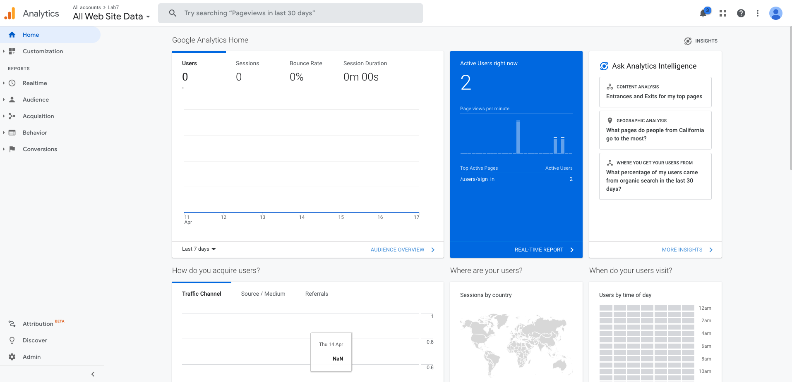
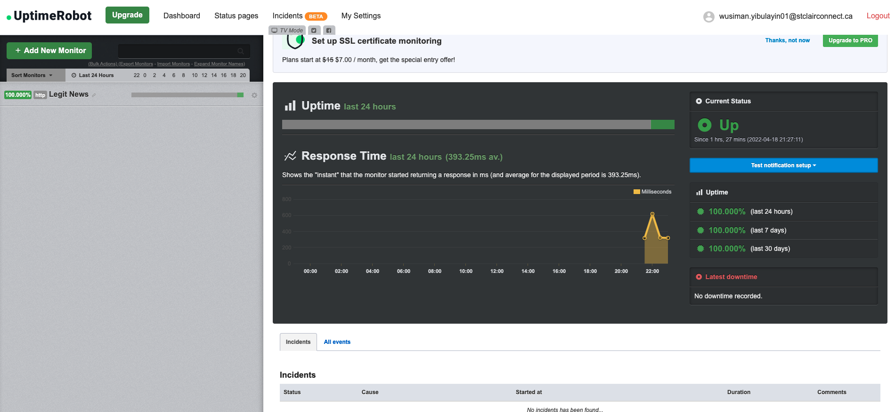
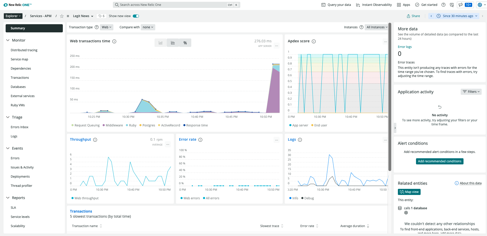
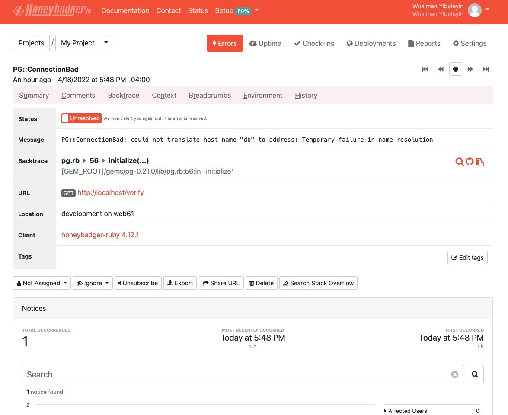
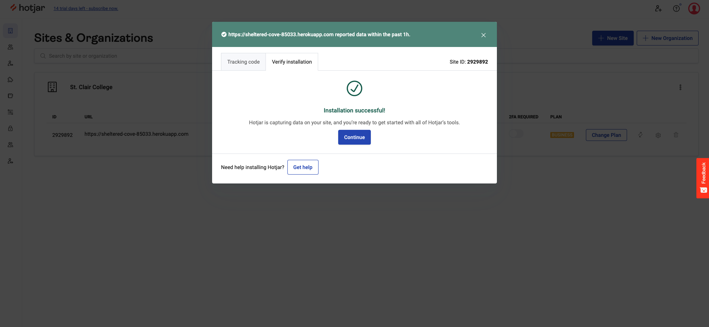

# WEB615 - Lab 7
### Based on Lab6 

### Author: Ibrahim (Wusiman Yibulayin)

## Completed Tasks

### Part 1 - Google Analytics

### Part 2 - Uptime Robot

### Part 3 - New Relic

### Part 4 - HoneyBadger

### Part 5 - HotJar

## Project Deployed to <a href='https://sheltered-cove-85033.herokuapp.com'> Heroku </a>